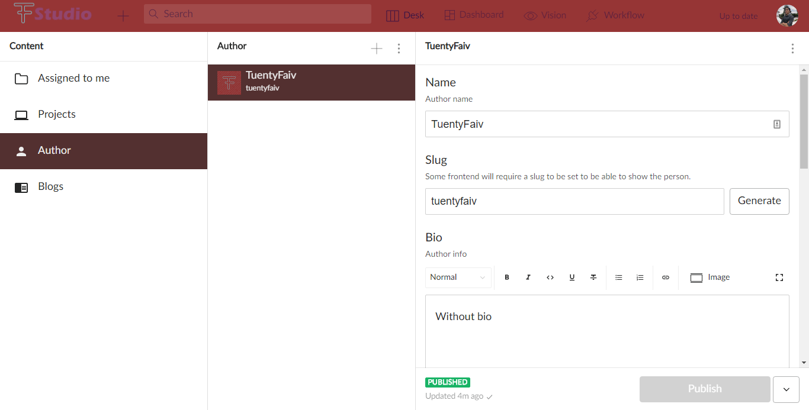

# My CMS created with [Sanity.io](https://sanity.io/)

Personalize it specifically for my website where I have all my projects and blogs: 
- [Projects](https://tuentyfaiv.com/)
- [Blogs](https://tuentyfaiv.com/blog)

Docs from sanity.io

- [Read “getting started” in the docs](https://www.sanity.io/docs/introduction/getting-started?utm_source=readme)
- [Join the community Slack](https://slack.sanity.io/?utm_source=readme)
- [Extend and build plugins](https://www.sanity.io/docs/content-studio/extending?utm_source=readme)
